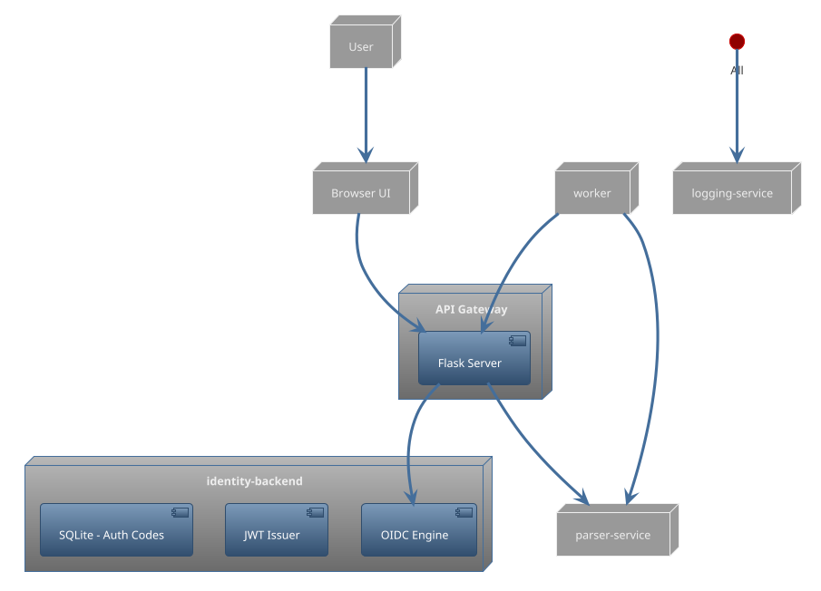
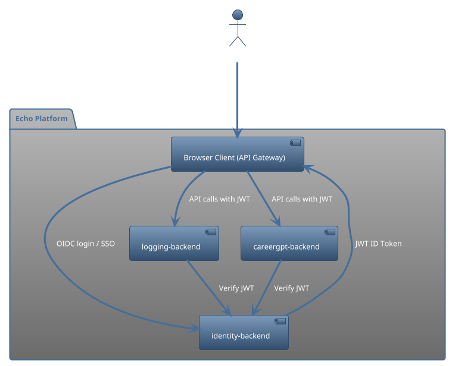
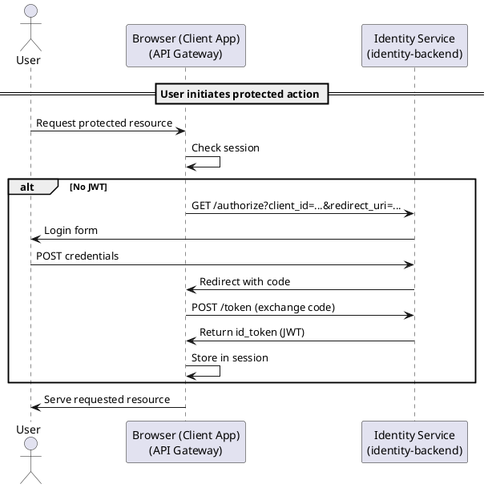
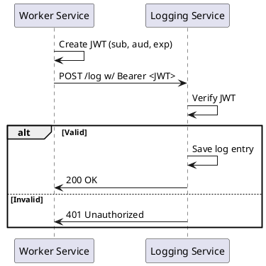
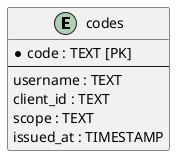
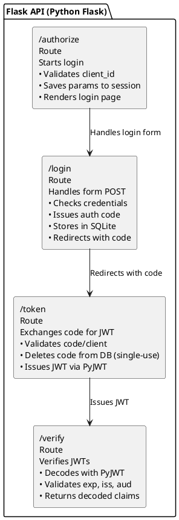

# 🔐 Identity System Architecture (Echo Platform)

## 📦 Container Diagram – Entire Echo Platform

## 🌐 System Context Diagram

---

## 🔁 OAuth2 / OIDC Authorization Code Flow

---

## 🔄 Service-to-Service Auth Flow

---

## 🗃️ Auth Code Table Schema

![[Auth Code Table Schema]](https://aurorahours.com/images/identity-codes-schema.png)

---

## ✅ Component Diagram – Flask API (Portable Version)

---

## 💡 Deployment Notes

- Reverse proxy assumed (cPanel Passenger WSGI or NGINX)
- All secrets via env vars (no `.env` in production)
- Stateless JWT architecture: horizontally scalable
- Logging centralized to `/log` endpoint

---
MIT (c) 2025 Saad Aziz and partners
