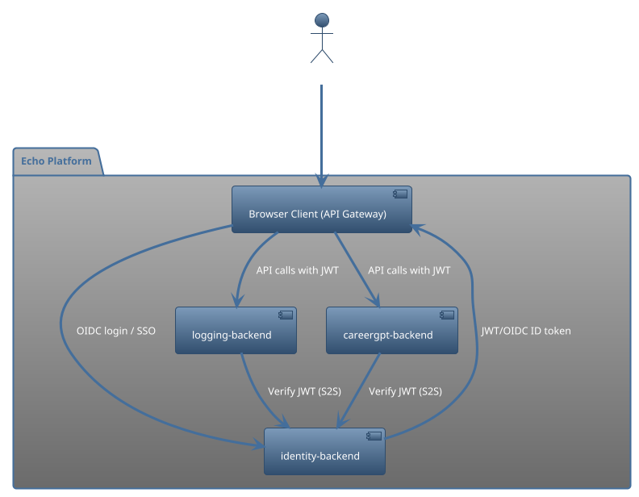
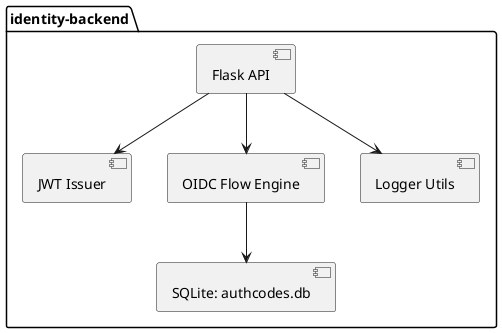
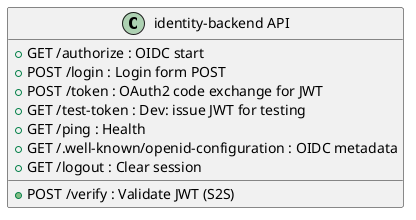
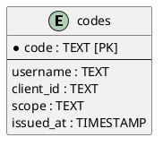
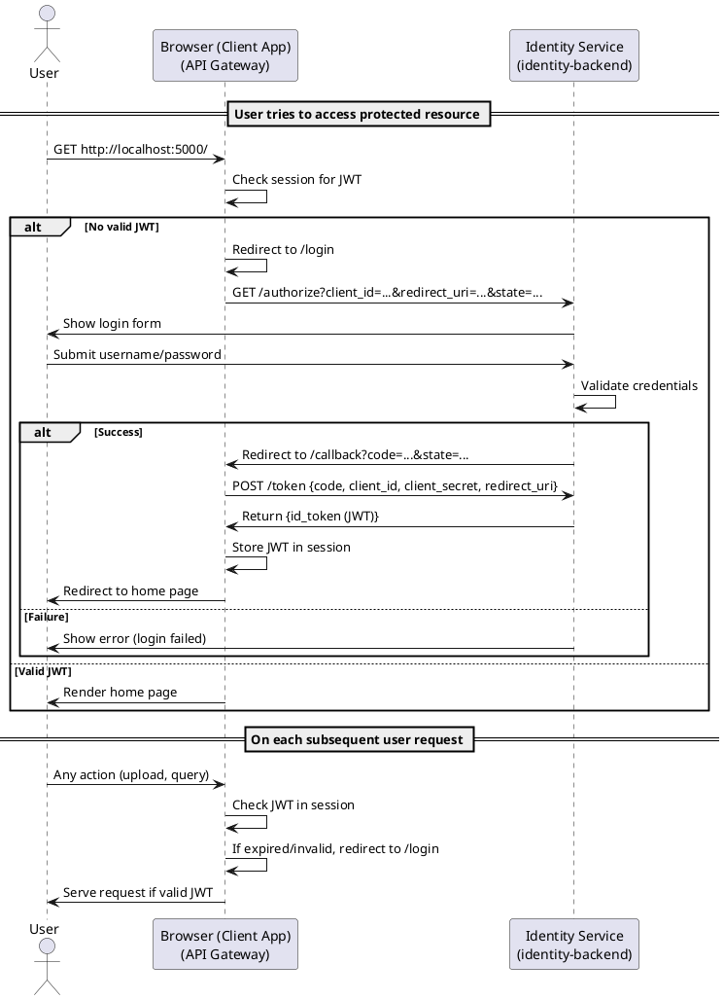
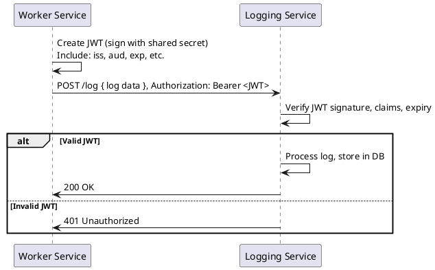

# Identity Backend Service (`identity-backend`)

The **identity-backend** is a secure JWT issuer and OpenID Connect (OIDC) identity provider for a microservices platform.  
It powers both Single Sign-On (SSO) for users and secure, token-based service-to-service authentication.

---

## Overview

- **User Login**: OAuth2 Authorization Code Flow + OIDC for browser-based SSO.
- **Service-to-Service JWT**: Issues and validates JWTs for backend services like `logging-backend` and `careergpt-backend`.
- **Microservices-Ready**: Hardened for Python and REST environments.

---

## Features
- OAuth2 Authorization Code and JWT-based service-to-service authentication
- Fully environment-config driven
- No hardcoded secrets
- Easy to audit, deploy, and rotate credentials
- Built-in logging and central log service support

---

## 📐 Architecture & Flows

### System Context


<details>
<summary>PlantUML: System Context</summary>



</details>

---

### Component Diagram

<details>
<summary>PlantUML: Main Components</summary>



</details>

---

### REST API Endpoints

<details>
<summary>PlantUML: REST API (C4 Container)</summary>



</details>

---

### Data Model: Auth Codes DB


<details>
<summary>PlantUML: SQLite Table (authcodes.db)</summary>




</details>

---

## 🔄 Sequence Diagrams

### 1. User SSO: OAuth2/OIDC Authorization Code Flow


<details>
<summary>PlantUML: OIDC Authorization Code Flow</summary>



</details>

---

### 2. Service-to-Service JWT Authentication


<details>
<summary>PlantUML: Service-to-Service JWT</summary>



</details>

---

## 📖 How the Code Works

* **OIDC SSO:**
  `/authorize` + `/login` + `/token` implement the full Authorization Code + OIDC ID token flow for browser SSO.
* **JWT S2S:**
  `/token` (POST) also supports backend services (S2S) if you POST the correct `sub`/`aud`.
* **JWT Verification:**
  `/verify` allows clients/services to validate JWTs issued by this service.
* **Dev Test:**
  `/test-token` instantly issues a valid JWT for dev/testing (never expose in prod).
* **Health/Meta:**
  `/ping` (health), `/.well-known/openid-configuration` (OIDC discovery), `/logout` (session clear).

---

## 💡 Pro Tip

* Paste any JWT into [jwt.io](https://jwt.io/) to inspect its claims.
* Use the diagrams for onboarding, docs, and architecture review.

---

## Secrets
```bash
python -c "import secrets; print(secrets.token_urlsafe(32))"
dkYM8s8HJGPjjWdXeC9M8uKDnt-G_faRZOEeMYSx4p4
```
---

### Configuration & Secrets
- All critical secrets and service configuration are loaded only from environment variables.
- No secret or key is hardcoded anywhere in the repo.

### Required environment variables:

| Name                     | Purpose                        | Example Value                                 |
|--------------------------|--------------------------------|-----------------------------------------------|
| FLASK_SECRET_KEY         | Flask session/cookie signing   | (see below to generate)                       |
| JWT_SECRET_KEY           | JWT signing secret             | (see below to generate)                       |
| JWT_ISSUER               | JWT issuer                     | https://aurorahours.com/identity-backend      |
| JWT_EXPIRATION_MINUTES   | JWT expiry (minutes)           | 15                                            |
| DEMO_USERNAME            | Demo login (dev only)          | u                                             |
| DEMO_PASSWORD            | Demo login (dev only)          | p                                             |
| BROWSER_UI_CLIENT_SECRET | Example OIDC client secret     | dev-client-secret-default                     |
| LOGGING_BACKEND_URL      | URL for central log service    | https://aurorahours.com/logging-backend       |
| LOGGING_BACKEND_AUD      | Log backend JWT audience       | logging-service                               |
| IDENTITY_SUB             | This service's ID in JWTs      | identity-backend                              |


Note:
 - For production, these are set in the cPanel Python App → Environment Variables.
 - For local/dev, you can use a .env file (not committed to git).

## Generating Secrets
 - Always use strong, random secrets for production!
 - Generate these from your terminal/command prompt:

```bash
# For Flask secret key (session cookies)
python -c "import secrets; print(secrets.token_urlsafe(32))"
# For JWT secret key (JWT signing)
python -c "import secrets; print(secrets.token_urlsafe(64))"

```
Copy the output and use it for the respective environment variable.

---

## cPanel Deployment
- Upload your code to your app directory (not public_html).
- Ensure you have a passenger_wsgi.py like:
```python
from app import app as application
```

- Use the cPanel “Setup Python App” to:

```
Set the app directory and Python version

Install requirements: pip install -r requirements.txt

Set all environment variables (see above)

Restart the app after config changes
```
---

## Warning
- Never use a .env file in production.
 - Use the cPanel UI to manage secrets.

---

## Security Review Checklist
- No hardcoded secrets in any Python or config file
- No .env or secrets committed to source control
- Fails to start if critical secret is missing (fail-fast pattern recommended in config.py!)
- All secrets are loaded via os.getenv and injected via cPanel env vars
- JWT issuer, audience, subject, and session secrets are fully configurable per environment
- Easy rotation: just update the environment variable and restart
- To verify:
- Rename/remove a required env var and restart the app. It should fail to boot.
- Run: git log -p | grep -i secret to verify no secret exposure in repo history.

---

## Development
- Clone the repo and install dependencies:

```bash
pip install -r requirements.txt
```

- Create a .env file in your app directory for local development (see Configuration & Secrets).
- Use flask run or cPanel’s WSGI boot as needed.

---


MIT (c) 2025 Saad Aziz and partners
