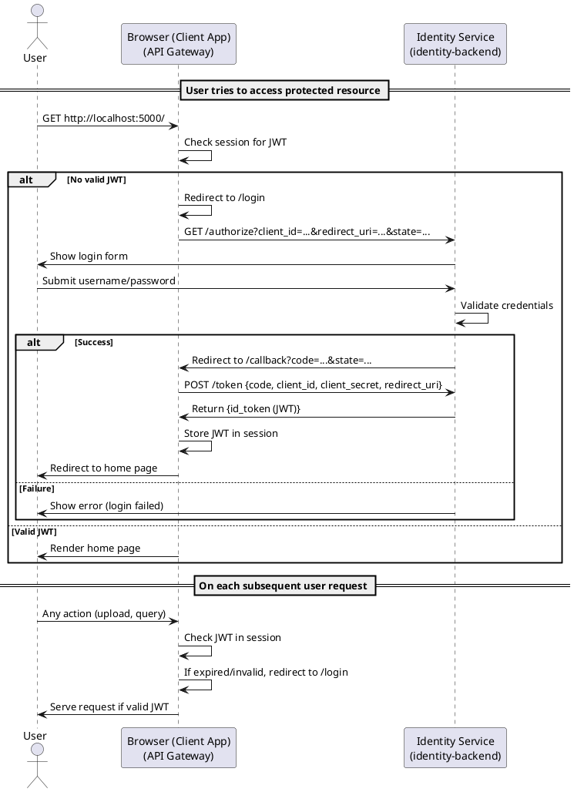
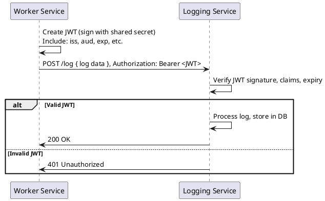

# Identity Backend Service (`identity-backend`)

The **identity-backend** is a secure JWT issuer and OpenID Connect (OIDC) identity provider for your microservices platform. It powers both Single Sign-On (SSO) for users and secure, token-based service-to-service authentication.

---

## Overview

- **User Login**: Implements OAuth2 Authorization Code Flow + OIDC, powering browser-based SSO for all client apps.
- **Service-to-Service JWT**: Issues and validates JWTs for backend services like `logging-backend` and `careergpt-backend`.
- **Built for microservices**: Hardened for modern Python and REST environments.

---

## Architecture & Flows

### User Login: OAuth2/OIDC Authorization Code Flow


<details>
<summary>View PlantUML Source</summary>



</details>

---

### Service-to-Service JWT Authentication


<details>
<summary>View PlantUML Source</summary>



</details>

---

## Quick Start

### 1. **Environment Variables**

Set the following in `.env` (for local) or your deployment environment:

| Variable                   | Description                                    | Example/Default                            |
| -------------------------- | ---------------------------------------------- | ------------------------------------------ |
| `JWT_SECRET_KEY`           | Strong shared secret (must match all services) | `your_shared_secret`                       |
| `JWT_ISSUER`               | Unique URL or name for issuer                  | `https://aurorahours.com/identity-backend` |
| `JWT_EXPIRATION_MINUTES`   | Token expiry (minutes)                         | `15`                                       |
| `BROWSER_UI_CLIENT_SECRET` | Secret for browser-ui client                   | `dev-client-secret`                        |

* All variables **must match** across services for secure validation.

---

### 2. **Install Requirements**

```bash
pip install -r requirements.txt
```

* Python 3.8+
* Flask, PyJWT, python-dotenv

---

### 3. **Deploy (cPanel or any WSGI host)**

1. Upload code to `/identity-backend`
2. Configure variables in **Setup Python App**
3. Install packages:
   `pip install -r requirements.txt`
4. Restart with:

   ```
   touch tmp/restart.txt
   ```

---

## API Reference

### 1. **Health Check**

**GET** `/ping`
Returns `OK` if running.

---

### 2. **Generate JWT**

**POST** `/token`

```json
{
  "sub": "careergpt-backend",
  "aud": "logging-service"
}
```

**cURL:**

```bash
curl -X POST "https://aurorahours.com/identity-backend/token" \
  -H "Content-Type: application/json" \
  -d '{"sub":"careergpt-backend","aud":"logging-service"}'
```

---

### 3. **Verify JWT**

**POST** `/verify`

```json
{
  "token": "<jwt_here>",
  "aud": "logging-service"
}
```

---

### 4. **Debug Environment (optional)**

**GET** `/debug-env`
Returns current config (never expose in production).

---

## Integration Example

### PowerShell: Generate & Use JWT

```powershell
# Generate JWT
$resp = Invoke-RestMethod -Uri "https://aurorahours.com/identity-backend/token" `
  -Method POST `
  -Headers @{"Content-Type"="application/json"} `
  -Body '{"sub":"careergpt-backend","aud":"logging-service"}'
$token = $resp.token

# Use JWT to log
Invoke-RestMethod -Uri "https://aurorahours.com/logging-backend/log" `
  -Method POST `
  -Headers @{"Authorization"="Bearer $token"; "Content-Type"="application/json"} `
  -Body '{"service":"careergpt","level":"INFO","message":"Test log"}'
```

---

## Integration Notes

* **identity-backend** issues JWTs for both user login (SSO) and secure service-to-service authentication.
* All backend services must share the same `JWT_SECRET_KEY` and `JWT_ISSUER`.
* All requests to protected endpoints must include a valid JWT in the `Authorization` header.

---

## Common Issues

* **Invalid audience/issuer**: Check that `aud` and `iss` match your config.
* **Token expired**: Request a new token from `/token`.
* **Signature verification failed**: Make sure secrets are in sync across services.

---

## Release & Operations

* **Always update both identity-backend and logging-backend to use the same `JWT_SECRET_KEY` before deployment.**
* Tag releases consistently (`v1.0.0`) and deploy both together.
* Use `/debug-env` to confirm environment variable consistency (disable in prod).

---

## Contributing & Updating Diagrams

* Keep all PlantUML sources in `/docs/architecture/` in source control.
* Regenerate PNGs using PlantUML whenever flows are updated.
* Update this README with any changes to authentication flow or endpoints.

---


